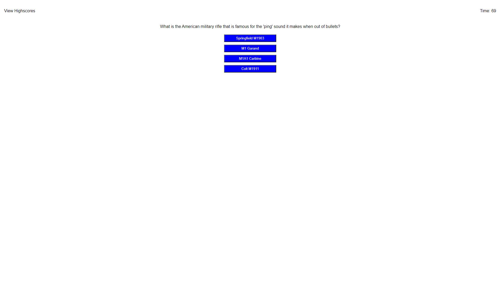

# Coding-Quiz'

This is a quiz that is created using HTML to make the webpage, CSS to style it, and JavaScript to make the buttons and answers work. The user has 75 seconds to answer 10 questions. If they get the question correct, their score goes up by 1 whereas if they get the question incorrect, their score is decreased by 5 seconds. Once all of the questions are answered or time runs out, the user is prompted to enter their name to store their score into the scoreboard which is displayed after a name is submitted. This scoreboard can be accessed at any time by clicking on the View Highscores in the top left corner of the webpage. There the user has the option to go back to the main quiz page or clear the scoreboard of all stored scores. Enjoy!

**Above is a picture of what the webpage looks like when you first arrive.**

 

**Above is a picture of what the webpage looks like with a question on the screen.**

 

**Above is a picture of what the webpage looks like once the quiz is over. It will tell you what your score was and prompt the user to enter a name and submit their score to the scoreboard.**

 

**Above is a picture of what the webpage looks like with an entry in the scoreboard.**